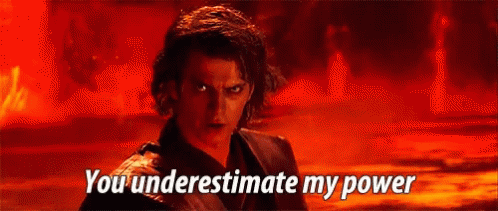
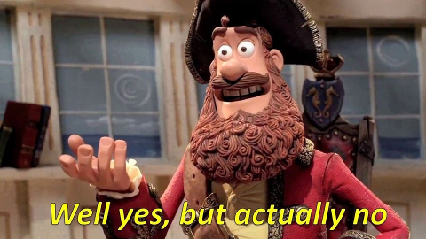
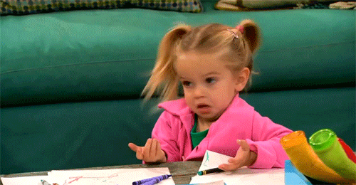

## Who we are
<div class="columns-2">


Koen Neijenhuijs

\@KNeijenhuijs

k.i.neijenhuijs@vu.nl

</div>

<br>

<div class="columns-2">

<br>

Sam Parsons

\@sam_d_parsons

sam.parsons@psy.ox.ac.uk

</div>

## Measurement Error {.build}
Always there

Always watching

<div class="centered">

</div>

## What is Measurement Error? {.flexbox .vcenter}

**Observational error** (or **measurement error**) is the difference between a measured value of a quantity and its true value.

```{r echo=FALSE, warning=FALSE, message=FALSE, error=FALSE}
library(ggplot2)
library(ggthemes)

datPlot <- data.frame(Person = c(1, 1, 2, 2), 
                    Value = as.factor(rep(c("Measured", "True"), times=2)),
                    y = c(20, 30, 25, 10))

ggplot(datPlot) + 
  geom_point(aes(x=Person, y=y, color=Value)) + 
  scale_y_continuous(limits=c(0,50)) +
  geom_segment(aes(x=1, xend=1, y=21, yend=29), color="gray55", arrow=arrow()) +
  annotate("text", x=1.2, y=25, label="+10", color="gray55") +
  geom_segment(aes(x=2, xend=2, y=24, yend=11), color="gray55", arrow=arrow()) +
  annotate("text", x=1.8, y=17.5, label="-15", color="gray55") +
  scale_x_continuous(limits=c(0,3), breaks=c(1,2), labels=c("Person 1", "Person 2")) +
  theme_few()
```

## What is Measurement Error?
Systematic measurement error: inaccuracies inherent to the measurement tool

*E.g. Miscalibrated computer for reaction time*

Random measurement error: Unpredictable fluctuations in measurement

*E.g. During reaction time measurement, a participant may be distracted on some trials*

## error, and therefore reliability, are sample dependant

No, you cannot rely on other studies

<br>

No, you cant rely on test manuals / validation studies for estimates

<br>

Yes, you should assess error in each sample


## Determining Measurement Error?
We don't know the true value, so can't calculate...

Can estimate the minimum value change that is not measurement error: Smallest Detectable Change

## Smallest Detectable Change {.build}

$$Reliability = {\sigma^2 participants \over \sigma² participants + \sigma² error}$$

$$Standard\, Error\, of\, Measurement = \sqrt {\sigma² error}$$

$$Standard\, Error\, of\, Measurement = SD * \sqrt {1-ICC}$$

$$Smallest\, Detectable\, Change = 1.96 * \sqrt {2} * SEM$$

$$Smallest\, Detectable\, Change = 1.96 * SD_{change}$$

## Smallest Detectable Change {.build}
$$Smallest\, Detectable\, Change = 1.96 * \sqrt {2} * SEM$$

$$Smallest\, Detectable\, Change = 1.96 * SD_{change}$$

SDC is the smallest change in score that you can detect above the measurement error

Note that we are using a z-distribution (1.96):

5% of cases where we judge the change score above the measurement error, this is a type I error...

<div class="centered">

</div>

## SDC and reliability
SDC can be calculated from Intraclass Correlation Coefficients (ICC)

Reliability is "the degree to which the measurement is free from measurement error" [@Mokkink2010a]

## Limits of Agreement
SDC is not the only value of measurement error

Limits of Agreement show... well, the limits of agreement between two measures

Often used to compare two sets of measurements from two instruments, but can also be used for two sets of measurements from the same instrument

Bland-Altman method:

$$Limits\, of\, Agreement = Mean_{difference} \pm 1.96 * SD_{difference}$$

Limits of Agreement is a Confidence Interval in disguise

## Bland-Altman plot
The plot below is of two measurements with a *Mean* of **20**, and *sd*'s of **2.5** and **10**

```{r echo=FALSE, warning=FALSE, message=FALSE, error=FALSE}
library(ggplot2)
library(dplyr)
library(ggthemes)

datPlot <- data.frame(Measurement1 = rnorm(40, 20, 2.5),
                      Measurement2 = rnorm(40, 20, 10)) %>% rowwise() %>%
  mutate(Avg = mean(c(Measurement1, Measurement2)), Dif=Measurement1-Measurement2)

ggplot(datPlot, aes(x=Avg, y=Dif)) + 
  geom_point(alpha=0.7) +
  geom_hline(yintercept = mean(datPlot$Dif), colour = "blue", size = 0.5) +
  geom_hline(yintercept = mean(datPlot$Dif) - (1.96 * sd(datPlot$Dif)), colour = "red", size = 0.5) +
  geom_hline(yintercept = mean(datPlot$Dif) + (1.96 * sd(datPlot$Dif)), colour = "red", size = 0.5) +
  ylab("Diff. Between Measures") +
  xlab("Average Measure") +
  theme_few()
```

## How we currently deal with measurement error
We aggregate within participants (to eliminate random measurement error)

*E.g. The different levels of distraction of a participant should even out across trials*

We aggregate between participants (to eliminate systematic measurement error)

*E.g. Participants that don't take the measurement seriously, should be evened out by participants who do*

## Problem solved then?! {.flexbox .vcenter}



## We all love simulations, amirite?

Simulation based on a RCT for treatment of depression, measured by the BDI-II.

BDI-II has range of 0 - 63. Pooled baseline means and sd's of clinical samples from systematic review [@Wang2013]: Baseline mean = 24.1, baseline sd = 11.4

Assume a score decrease of 15.7% for untreated depression [@Posternak2001], which translates to a mean decrease of 9.828. The SD was arbitrarily set to 40% of this decrease to 3.9312.

## Simulation continued

The treatment group received further decrease, based on the MCID of the BDI-II, which was determined to be 18% [@Button2015], leading to a MCID of 4.338.

Measurement error was added based on a percentage of the range of the BDI-II.

## Simulation parameters

Sample size: 250 / 500 / 750

Effect size: 0 / 2\*MCID / 4\*MCID / 6*MCID

Measurement error: 0 / 10% / 20% / 30% / 40%

5000 replications per parameter combination

Simulations performed using SimDesign package [@SimDesign].

Code can be found on my Github: [https://github.com/kneijenhuijs/SIPS-2019-Measurement-Error](https://github.com/kneijenhuijs/SIPS-2019-Measurement-Error)

## Simulation results

```{r echo=FALSE, warning=FALSE, message=FALSE, error=FALSE}
library(here)
library(ggplot2)
library(ggthemes)
library(tidyverse)
results <- readRDS(here("results.rds"))
```

```{r echo=FALSE, warning=FALSE, message=FALSE, error=FALSE}
ggplot(results, aes(x=measError, y=SE_Int, fill=effectSize)) + 
  geom_violin(scale="width", color="black", position = position_dodge(width = 0.9)) + 
  geom_boxplot(color="black", position = position_dodge(width = 0.9), show.legend = FALSE, width=0.3) +
  labs(x="Measurement error", y="SE of Interaction") + 
  scale_x_discrete(labels=c("0%", "10%", "20%", "30%", "40%")) + 
  scale_fill_viridis_d(name = "Effect size", labels = c("0 * MCID", "1 * MCID", "2 * MCID", "3 * MCID")) +
  ggtitle("Standard Error of Interaction Coefficient") +
  theme_gdocs()
```

## Simulation results

```{r echo=FALSE, warning=FALSE, message=FALSE, error=FALSE}
ggplot(results, aes(x=measError, y=bias_Int)) + 
  geom_violin(scale="width", color="black", position = position_dodge(width = 0.9), fill="deepskyblue4") + 
  geom_boxplot(color="black", position = position_dodge(width = 0.9), show.legend = FALSE, width=0.3, fill="deepskyblue4") +
  labs(color="Mean effect", x="Measurement error", y="Bias of Interaction") + 
  scale_x_discrete(labels=c("0%", "10%", "20%", "30%", "40%")) + 
  ggtitle("Relative Bias of Interaction Coefficient") +
  theme_gdocs()
```

## Simulation results

```{r echo=FALSE, warning=FALSE, message=FALSE, error=FALSE}
ggplot(results, aes(x=measError, y=ETA_Int, fill=effectSize)) + 
  geom_violin(scale="width", color="black", position = position_dodge(width = 0.9)) + 
  geom_boxplot(color="black", position = position_dodge(width = 0.9), show.legend = FALSE, width=0.3) +
  labs(x="Measurement error", y="Eta² of Interaction") + 
  scale_x_discrete(labels=c("0%", "10%", "20%", "30%", "40%")) + 
  scale_fill_viridis_d(name = "Effect size", labels = c("0 * MCID", "1 * MCID", "2 * MCID", "3 * MCID")) +
  ggtitle("ETA² of Interaction Coefficient") +
  theme_gdocs()
```

## Simulation wrap-up

For a more thorough write-up of the simulations, see the Github page for this unconference:

[https://kneijenhuijs.github.io/SIPS-2019-Measurement-Error/](https://kneijenhuijs.github.io/SIPS-2019-Measurement-Error/)

## Measurement error in experimental psychology {.build}

Are our **tasks** reliable?

<div class="centered">

</div>

## The reliability paradox {.build}

@hedge_reliability_2018 Why robust cognitive tasks do not produce reliable individual differences 

<div class="centered">

</div>

<br>

e.g. everybody shows the stroop effect. Yet, the measure often shows poor psychometric properties

## "normal" reliability indices dont work for tasks

Difference scores make this difficult for internal consistency measures

Cronbach's alpha (also omega) are likely unsuitable

(Shameless self-promotion) @Parsons2019 offer suggestions, examples, and code to estimate and report reliability of task measures. 

(second shameless self-promotion) the R package splithalf performs permutation-based splithalf estimates of reliability

## Splithalf

```{r echo = TRUE, eval = FALSE}
splithalf(data = Hedge_raw,
          outcome = "RT",
          score = "difference",
          permutations = 5000,
          var.trialnum = "Trial",
          var.condition = "time",
          conditionlist = c(1, 2),
          var.compare = "Condition",
          compare1 = "congruent",
          compare2 = "incongruent",
          var.participant = "ppid",
          var.RT = "Reactiontime" )
```

<div class="centered">

</div>

## What about mixed-effect models?

Mixed-effect models can:

- Model the **random variance** inherent to participants across multiple measures
- Model the **random variance** inherent to stimuli across multiple measures
- Model the **random variance** inherent to *pretty much anything* across multiple measures

<font size="3">
Systematic measurement error: inaccuracies inherent to the measurement tool

*E.g. Miscalibrated computer for reaction time*

Random measurement error: Unpredictable fluctuations in measurement

*E.g. During reaction time measurement, a participant may be distracted on some trials*
</font>


## What about mixed-effect models?

For a further and saddening view, see @rouder_why_2019 "Why most studies of individual differences with inhibition tasks are bound to fail"

even modelling trial-level variability will not fully-recover true effects - never underestimate the power of error

## Flexibility in data processing {.build}


```{r out.width='80%', echo = FALSE, fig.align='center'}

knitr::include_graphics("pictures/dpt1.png")

```


## That's enough of us talking

The rest of all slides are of questions and statements for the room to discuss

For some of them we have prepared some answers we could think of

But first, let's take some time for an open discussion

## Is measurement error prevalent in your studies?

<br>
Is error/reliability reported enough to tell? 
<br>
<br>
<br>
<br>

<font size="3">
Systematic measurement error: inaccuracies inherent to the measurement tool

*E.g. Miscalibrated computer for reaction time*

Random measurement error: Unpredictable fluctuations in measurement

*E.g. During reaction time measurement, a participant may be distracted on some trials*
</font>


## Devil's advocate

Measurement error is unmeasurable, and therefore only theoretically relevant

Reliability is a problem with individual differences questions - we use experimental tasks, so we're fine?

## Is it feasible to run dedicated studies to investigate measurement error?

How about in your specific field?

## The use of SDC and LoA is limited

We calculate measurement error is always based on change scores (SDC & LoA), while measurement error is theoretically tied to a single measurement.

How limiting is this in its' application?

Are there possibilities of improving upon these methods?

## Measurement error and the reproducibility crisis

Measurement error may bias our findings. Can it be related to the reproducibility crisis?

*Doesn't measurement error inflate both the original and the reproduction?*

## Incorporating measurement error into our data-analyses

Accuracy benchmarks / *Uninformed* comparators

E.g. Does a random estimator outperform sample means in accuracy?
Using Mean Squared Error [@Davis-Stober2018] (very good read!)

*"We consider the sample means to be minimally accurate if they are more accurate than random estimators that scramble the relations among conditions"*

*"Whether the random estimator incurs less Mean Square Error than sample means depends upon the environment, i.e., sample size and effect size"*

## Accuracy benchmark example
<font size="3">
*"The sample means for this set of data are equal to: y1 = 593 ms, y2 = 626 ms, y3 = 630 ms, and y4 = 756 ms, for Conditions 1-4 respectively. We refer to this pattern of means as the observed pattern of treatment effects. Now, let’s consider what the random estimator would yield as estimates of the population means for these data. First, we draw four uniform random numbers from the [−1, 1] interval that correspond to the four conditions. For Condition 1, we obtain -.190, for Condition 2, we obtain -.973, for Condition 3, we obtain.823, and for Condition 4 we obtain .600. Note that once a random number has been drawn for a condition, we cannot shuffle or re-assign it to another condition after the fact. We calculate the scale factor of b as 21.5, which portends quite a bit of shrinkage. Using this value, the random estimates are: mre1 = 647 ms, mre2 = 630 ms, mre3 = 669 ms, mre4 = 664 ms. Note that all four estimates are close to the grand mean. Recall that the order of the sample means was: Condition 1 < Condition 2 < Condition 3 < Condition 4. In contrast, the random estimator now assigns the order: Condition 2 < Condition 1 < Condition 4 < Condition 3. This is the same random order that was produced by the random ai draws. Note also that the relative distance between the random estimates has also been randomized; the estimates for Conditions 3 and 4 are quite close, in contrast to the sample means, where y4 is relatively farther from y3."*

</font size>

## Incorporating measurement error into our data-analyses

So we may find out our sample means are inaccurate (i.e. too much measurement error)...

What now?

<div class="centered">

</div>

## Incorporating measurement error into our data-analyses

For many analyses (e.g. mixed-effect models, Bayesian estimators) it is already advised (unfortunately not yet common) practice to report the ICC

As measurement error is a reflection of the ICC, is there a way to directly incorporate the ICC into the analysis itself?

## References

<font size="2.5">